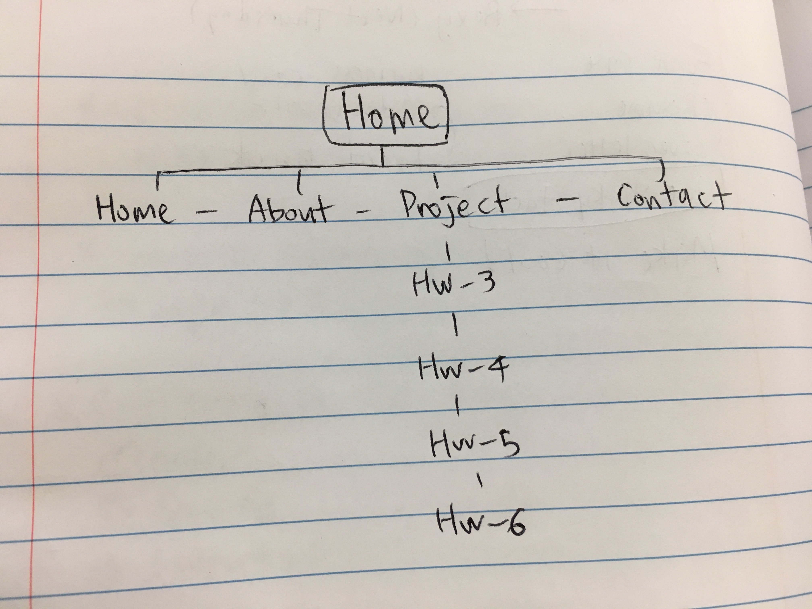

Hyein Kang
MART 341 Final Website!

I decided to use as much as I can that I made through this semester.

I made the outline like this for final website.

For the Homepage, I used the assignment week 11 to introduce my personal perspective and how my works look like in parallel.

For the about page, I used the assignment week 10 about myself!

For the MART 341 Project page, I used week 4, 5, 6, 8 that I've done this semester in this class. Everyone can see how my works get improved!

For the Contact page, I made boxes so people can easily contact to me. Hopefully it works.

I had really good time learning building websites this semester! Thanks.
